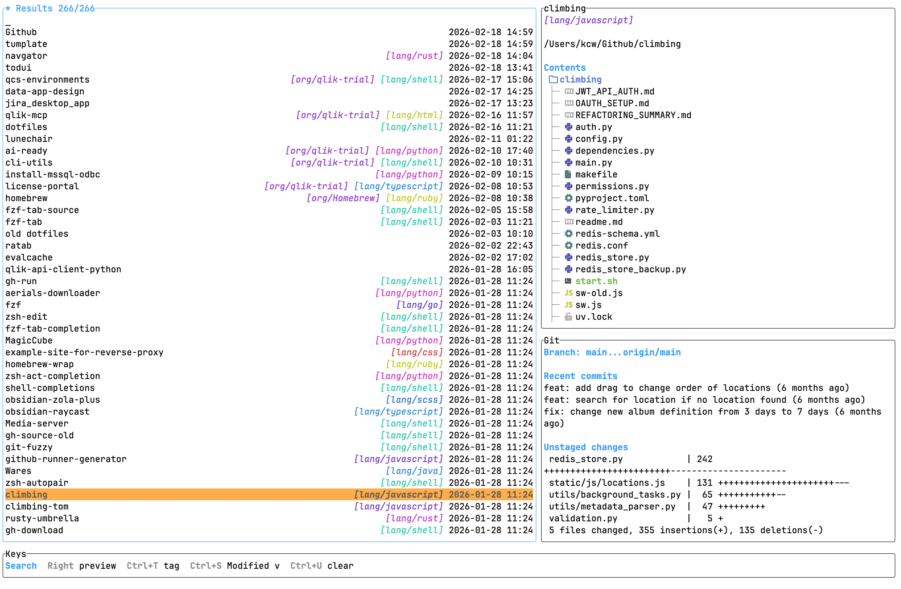

# navgator

Rust TUI tools for project navigation and GitHub issue exploration. Shared generic helpers live in `navgator-core`; each TUI is its own binary crate.



## Build

```
cargo build --release --workspace
```

## Run

```
./target/release/navgator-navigate
```

Explore GitHub issues for the repo in the current folder:

```
./target/release/navgator-issues
```

## Zsh wrapper

Load the wrapper in the current shell:

```
source scripts/navgator.zsh
```

The wrapper defines a Zsh widget named `navigate`. Bind it to a shortcut with `bindkey`. This example binds `Ctrl+T`:

```
bindkey '^T' navigate
```

For a persistent shortcut, add both lines to your `~/.zshrc`:

```
source /path/to/navgator/scripts/navgator.zsh
bindkey '^T' navigate
```

After restarting the shell, pressing `Ctrl+T` opens navgator. Selecting a row changes the current directory to the selected project or worktree.

You can use another key sequence if `Ctrl+T` is already taken. For example, `Ctrl+G`:

```
bindkey '^G' navigate
```

## Search

- Default: fuzzy match against folder paths and tags.
- `@term`: match folder path only.
- `#term`: match tags only.

Examples:

```
@create #mods
```

## Tags

Place a `.navgator.toml` in a folder:

```
tags = ["mods", "minecraft", "create"]
```

Tags render as colored pills in results and in the preview. Colors are deterministic per tag name.

## Sorting

Cycle with `Ctrl+S`:

- `Modified v` (default)
- `Match`
- `A->Z` / `Z->A`
- `Created ^` / `Created v`
- `Modified ^` / `Modified v`

Sorting by time triggers background metadata scans.

## Panels and navigation

- Search panel (left) edits query.
- Preview panel (right top) shows path and `erd` tree.
- Details panel (right bottom) tabs GitHub README/repo summary and Git details when available.
- Right/Left switch focus between panels; Up/Down scroll within panels.
- Mouse click focuses a panel; mouse wheel scrolls.

## GitHub issues

`navgator-issues` uses `gh` and the current repo's `origin` remote to show issues in a separate TUI.

- Type to filter by title, body, number, or labels.
- `#term` filters issue numbers and labels.
- `@term` filters authors and assignees.
- `Tab` cycles open, closed, and all issues.
- `r` refreshes from GitHub.
- `Enter` prints the selected issue URL.

## Preview tooling

- Uses `erd` with `~/.erdtreerc` if present; otherwise defaults:
  `--dir-order=first --icons --sort=name --level=4 --color force --layout=inverted --human --suppress-size`
- Git panel is hidden when not in a git repo.

## Config

If no config is found, navgator creates a default config at `$NAVGATOR_CONFIG` when set, otherwise at `$XDG_CONFIG_HOME/navgator/config.toml` or `~/.config/navgator/config.toml`.

Config file search order (merge all found):

- `$NAVGATOR_CONFIG`
- `/etc/navgator/config.toml`
- `$XDG_CONFIG_HOME/navgator/config.toml`
- `~/.config/navgator/config.toml`
- `~/.navgator.toml`
- `./.navgator.toml`
- `./.navgator/config.toml`

Config format (TOML):

```
"$schema" = "https://raw.githubusercontent.com/Yarden-zamir/Navgator/main/config-schema.json"

[paths]
index_folders = ["~/Github", "~/Projects"]
static_items = ["~/Downloads"]

[sort]
default = "modified-desc"
pin_current_project = true

[remote]
enabled_by_default = false
refresh_on_toggle = true
use_cache = true

[ui]
theme = "auto"

[preview]
shorten_worktree_tab_labels = true
worktree_tab_min_chars = 6
selected_worktree_tab_min_chars = 10
```

If an existing config contains `[paths]` but no `"$schema"`, navgator prepends this line automatically when loading that config.

`shorten_worktree_tab_labels` defaults to `true`; worktree branch labels like `feat/yarden/potato` render as `potato` in preview tabs. Set it to `false` to show full labels.
`worktree_tab_min_chars` defaults to `6`; `selected_worktree_tab_min_chars` defaults to `10`. These control how many label characters are kept before `...` when worktree preview tabs must shrink.

`[sort].default` accepts `match`, `alpha-asc`, `alpha-desc`, `created-asc`, `created-desc`, `modified-asc`, or `modified-desc`.
`[sort].pin_current_project` keeps the current Git worktree/project as the first row for empty searches.

`[remote].enabled_by_default` starts remote branch mode automatically.
`[remote].refresh_on_toggle` controls whether enabling remote mode runs a background network refresh.
`[remote].use_cache` controls whether cached remote branches are shown before local refs and refresh results.

`[ui].theme` accepts `auto`, `light`, or `dark`. On macOS, `auto` follows the system appearance; on other platforms it currently falls back to `light`.

Schema file is generated from the Rust config structs:

```
cargo run -p navgator-navigate -- config-schema > config-schema.json
```
